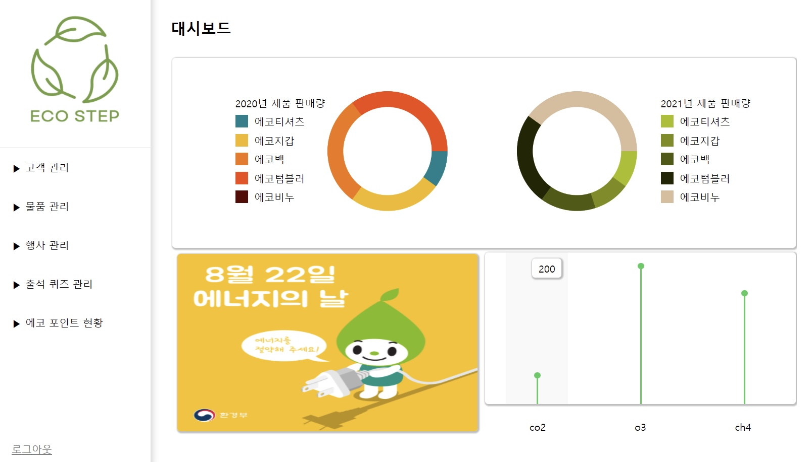

# 2021 공개 SW 개발자 대회 <a href="https://www.oss.kr/dev_competition"> >> </a>

# 에코 마일리지 적립 시스템 EcoStep

친환경 제품 구매 및 퀴즈 풀기를 통한 환경 보호 시스템

관리자 페이지 README입니다. 
<a href="https://github.com/2021echo-friends"> EcoStep Organization </a>

### 개발 일정

7월 15일 주제 선정 및 첫 회의 
9월 9일 개발 종료

### 기술 스택

FrontEnd
Language : HTML, CSS, Javascript
Library : React

BackEnd
Language : Javascript
Server : Ubuntu
Project Management : npm

### 팀원 구성 및 담당

1. 최윤석

-

2. 김주영

-

3. 박세찬
   BackEnd - 데이터베이스 구축 및 API 구현

### 관리자 페이지

[ ] 로그인 페이지

[ ] 메인 페이지

[ ] 고객 관리 페이지

[ ] 물품 관리 페이지

[ ] 행사 관리 페이지

[ ] 출석 퀴즈 관리 페이지

[ ] 에코 포인트 현황 페이지

### 해결했던 문제들 및 이슈
